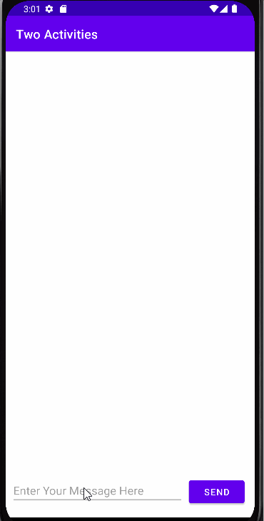
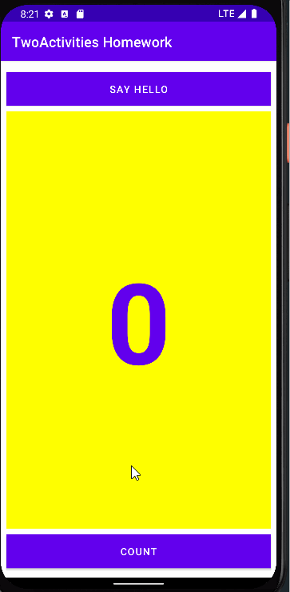
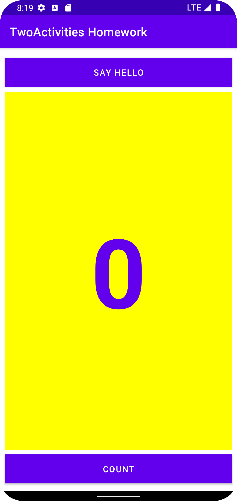

# Activities-and-intents

## Tasks

created and built an app called Two Activities 
In the first stage,  created an app whose main activity contains one button, Send. When the user clicks this button, main activity 
uses an intent to start the second activity.

In the second stage, added an EditText view to the main activity. The user enters a message and clicks Send. The main activity uses
an intent to start the second activity and send the user's message to the second activity. The second activity displays the message it received.

In the final stage of creating the Two Activities app, added an EditText and a Reply button to the second activity. The user can now type a reply message and 
tap Reply, and the reply is displayed on the main activity.

##  Coding challenge

An app contain three Button elements labeled Text One, Text Two, and Text Three. When any of these Button elements are clicked, launch a second Activity.
That second Activity should contain a ScrollView that displays one of three text passages 

Activities-and-intents challenge

## Homework

Toast button so that it launches a new Activity to display the word "Hello!" and the current count

Activities-and-intents homework

## Answer these questions

### Question 1
What changes are made when you add a second Activity to your app by choosing File > New > Activity and an Activity template?

Ans - The second Activity is added as a Java class, the XML layout file is created, and the AndroidManifest.xml file is changed to declare a second Activity.

### Question 2
What happens if you remove the android:parentActivityName and the <meta-data> elements from the second Activity declaration in the AndroidManifest.xml file? 
  
Ans - The Up button in the app bar no longer appears in the second Activity to send the user back to the parent Activity.
  
### Question 3
Which constructor method do you use to create a new explicit Intent? Choose one:
  
Ans - new Intent(Context context, Class<?> class)

### Question 4
In the HelloToast app homework, how do you add the current value of the count to the Intent? 

Ans - As an Intent extra

### Question 5
In the HelloToast app homework, how do you display the current count in the second "Hello" Activity?

Ans - All of the above.

